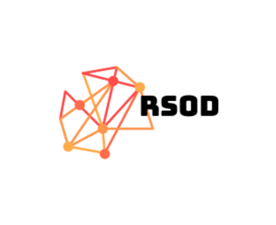
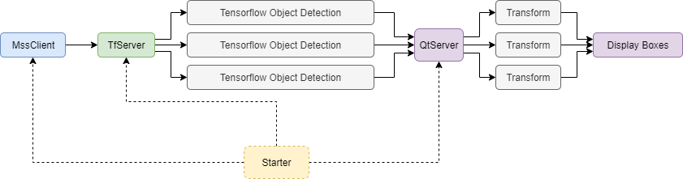
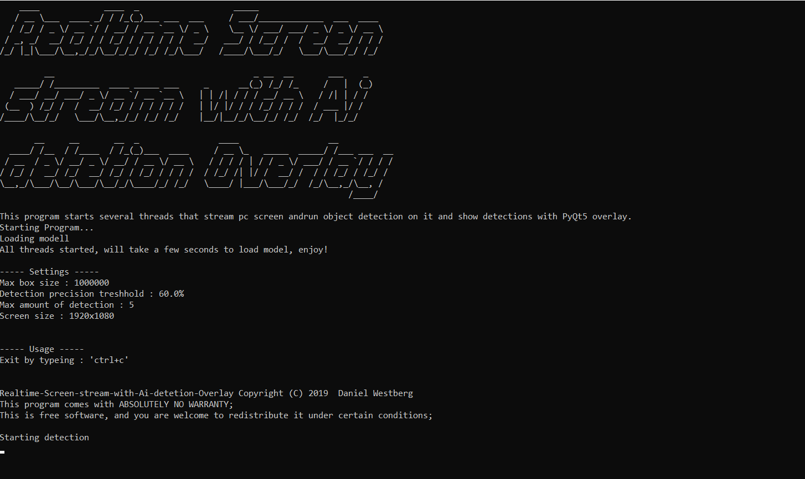

**NOTE**: Current implementation is under construction, and currently not working due to version incompatibility, when working it will be published in a new release! TODO:

yolo settings sync=false

<p align="center">
  
</p>


`NOTE:` I use low framerate and low precision object detection to save some
power on my laptop, feel free to change models, detection and remove loop delays.

# About
RSOD (Realtime Screen Object Detection) is a program I created to visualize
realtime object detetions on screen capture. To capture pc screen I use the `mss`
library. Detections are visualized through `PyQt5` as overlays. Feel free to try it out
and change setting variables in the `main.py` file. Possible usages for this program can
be to track and discover objects on screen to assist users or perhaps to enhanced
the general user experience.

# Install
This program is written for **python3**. The required python3 libraries are the following:

* `PyQt5` (used to overlay screen to show detections)
* `Tensorflow` (object detection)
* `mss` (capture screen stream)
* `Image`
* `opencv-python`
* `pyfiglet`
* `numpy`

If you have `Python3 pip` installed you can install required packages by running:

```bash
 pip install -r requirements.txt
```

# Run
This tutorial takes you through the execution of this program.

1. Install requirements above
2. Clone this repo or download it:
```git
git clone https://github.com/grebtsew/Realtime-Screen-Object-Detection.git
```
3. Run python script `main.py`

# Client Server
A client/server solution has been added to further increase performability and accelerate detections.
Test the implementation by running the `starter.py` file. The structure is explained below.


For demo purposes the starter starts the three seperate processes `MssClient`, `QtServer` and `TfServer`.
The `MssClient` reads screen images and send them to the `TfServer`. The `TfServer` will perform
object detections on the received imaged and send detection boxes to the `QtServer`. The `QtServer`
will display the incoming boxes from the `TfServer`. This will allow for seperation of the solution
and also acceleration of the detections. I would recommend placing the `TfServer` on a pc with high performance
ai hardware and let another pc only focus on displaying the detections.



# Use detection request Mode
In this mode the program will wait for requests from other clients and show the requested objects.
Example client message:
```
# Data to add persons to detection
data = {
    'value': "person",
    'type': 'add',
    'api_crypt':"password-1"
      }

# Data to remove dogs from detection
data = {
    'value': "dog",
    'type': 'remove',
    'api_crypt':"password-1"
      }
```
# Deprecated demo


# Screenshot
See screenshot of program execution below:


# License
[MIT](LICENSE)


COPYRIGHT @ Grebtsew 2019
