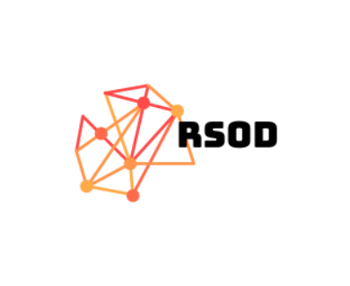
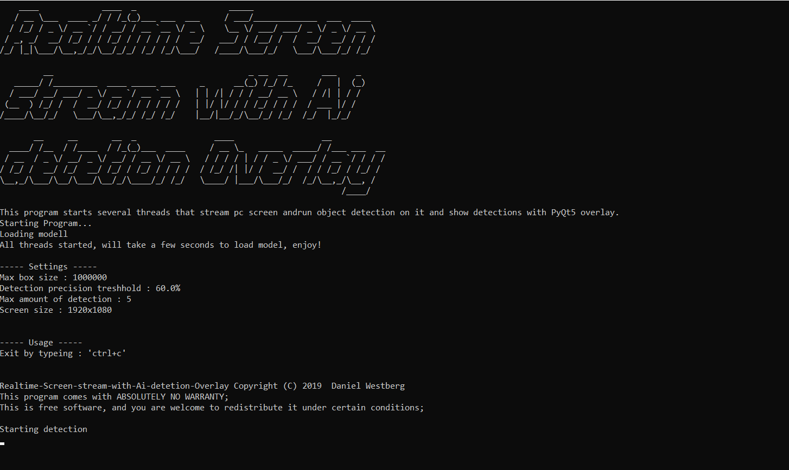

<p align="center">
  
</p>


`NOTE:` I use low framerate and low precision object detection to save some
power on my laptop, feel free to change models, detection and remove loop delays.

# About
RSOD (Realtime Screen Object Detection) is a program I created to visualize
realtime object detetions on screen capture. To capture pc screen I use the `mss`
library. Detections are visualized through `PyQt5` as overlays. Feel free to try it out
and change setting variables in the `main.py` file. Possible usages for this program can
be to track and discover objects on screen to assist users or perhaps to enhanced
the general user experience.

# Install
Several packages and programs are required to run this program.

* `Python3`
* `PyQt5` (used to overlay screen to show detections)
* `Tensorflow` (object detection)
* `mss` (capture screen stream)

If you have `Python3 pip` installed you can install required packages by running:

```bash
 pip install -r requirements.txt
```

# Run
This tutorial takes you through the execution of this program.

Run python script `main.py`

# Screenshot
See screenshot of program execution below:


# License
[MIT](LICENSE)

COPYRIGHT @ Grebtsew 2019
